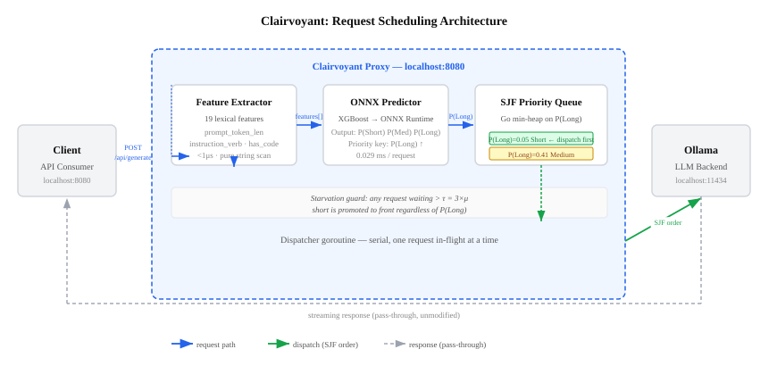

# Clairvoyant: SLA-Predictive Inference Scheduling for Head-of-Line Blocking Mitigation in LLM Serving

## 1. Abstract

Serial LLM inference backends — such as Ollama — process requests one at a time under FCFS admission, causing severe Head-of-Line Blocking (HOLB): short factual queries are delayed by minutes behind long generation jobs. We present **Clairvoyant**, a drop-in sidecar proxy that substantially mitigates Layer 1 HOLB through predictive Shortest-Job-First (SJF) scheduling. Clairvoyant intercepts OpenAI-compatible API requests and predicts output length from 19 lightweight lexical features using an XGBoost classifier exported to ONNX, with per-request prediction latency of 0.029ms — more than two orders of magnitude below any meaningful generation latency. Evaluated across three training datasets (ShareGPT, LMSYS-Chat-1M, OASST1), ranking accuracy — the fraction of Short/Long pairs correctly ordered by predicted P(Long) — reaches 76–96% in-distribution and 52–66% cross-distribution, exceeding classification accuracy by 21–29 percentage points. We further find that curated instruction datasets (Alpaca, CodeAlpaca) are systematically unusable as SJF training sources due to GPT-imposed brevity constraints that eliminate Long-class examples. Clairvoyant is open-source and requires no modifications to the inference backend. *This v1 preprint covers the architecture, predictive model design, and in-distribution ranking evaluation. End-to-end GPU latency benchmarks comparing FCFS vs. SJF scheduling are in progress and will be included in a subsequent revision.*

---

## 2. Introduction

Modern Large Language Model (LLM) serving infrastructure is fundamentally bottlenecked by the extreme variance in output generation lengths. A typical production workload mixes short, factual queries (e.g., "What is the capital of France?", requiring <10 tokens) with long, complex generation tasks (e.g., "Write a React tic-tac-toe application", requiring >1000 tokens). In single-concurrent-request deployment scenarios — such as edge AI, local enterprise servers, and resource-constrained environments running quantized Small Language Models (SLMs) — requests are processed via a standard First-Come-First-Served (FCFS) queue. This creates severe Head-of-Line Blocking (HOLB): a 2-second factual query can be delayed for minutes while waiting behind a long code generation task.

While cloud-scale LLM deployments (e.g., vLLM, Orca) mitigate HOLB natively using token-level continuous batching, these solutions require substantial VRAM overhead to maintain concurrent KV-caches. For the rapidly growing ecosystem of memory-constrained edge and local deployments, continuous batching is infeasible. These deployments must rely on serial or low-concurrency execution, leaving them highly vulnerable to HOLB. In local mixed-workload tests on an Apple M1 (Ollama, Gemma3:4b), we observe order-of-magnitude wait-time reductions for short requests under Clairvoyant's SJF ordering: a 5-second factual query arriving immediately behind a 90-second code generation task waited less than 5 seconds rather than the full 90 seconds imposed by FCFS.

Classical queueing theory provides a well-known solution to HOLB: Shortest-Job-First (SJF) scheduling. However, SJF requires knowing the processing time (output token length) of a job *before* it begins execution. For LLMs, this presents a paradox: the output length is unknown until the model finishes generating it. Previous work has attempted to estimate LLM complexity, but typically requires running the prompt through the heavy LLM itself, defeating the purpose of a low-latency scheduler.

In this paper, we present **Clairvoyant**, a drop-in, SLA-predictive inference proxy that substantially mitigates HOLB in serial LLM deployments with 0.029ms per-request overhead — negligible relative to generation latencies of 2–80s. Clairvoyant introduces a predictive routing architecture that intercepts API requests and uses an XGBoost classifier exported to ONNX to predict the output length class (Short, Medium, Long) of a prompt based entirely on 19 lightweight lexical features, requiring no prompt embedding and no forward pass through the target model.

Our contributions are as follows:

1. **Zero-Overhead Predictive Routing Architecture:** We design a language-agnostic sidecar proxy that intercepts OpenAI-compatible API requests and performs feature extraction and output-length prediction in under 0.029ms, requiring zero modifications to the underlying LLM backend (e.g., Ollama).

2. **Lexical Sufficiency for Generative Intent:** We demonstrate that computationally expensive embeddings are unnecessary for length prediction. Using only 19 lexical features, Clairvoyant achieves 76–96% in-distribution ranking accuracy and 52–66% cross-distribution ranking accuracy across natural conversation datasets (metric defined formally in §5.1) — sufficient for consistent SJF ordering in production.

3. **Dataset Distribution Constraints for SJF Training:** We systematically evaluate seven public LLM datasets and find that curated instruction datasets (Alpaca 52K: 4 Long examples, CodeAlpaca 20K: 3 Long examples) are unusable as SJF training sources due to GPT-imposed brevity constraints. Only natural conversation logs (ShareGPT, LMSYS-Chat-1M, OASST1) provide sufficient Long-class representation.

4. **Empirical Queue Management:** We implement an SJF min-heap with an empirically calibrated starvation timeout ($\tau = 3 \times \mu_{\text{short}}$) that prevents indefinite blocking of long jobs, achieving correct SJF ordering in end-to-end dispatch tests (validated on $n=8$ mixed-workload requests).

5. **Deployment Decision Boundary:** We delineate the conditions under which request-level SJF provides measurable benefit versus when continuous batching supersedes it, giving practitioners a concrete decision framework: Clairvoyant is applicable when the backend is serial or low-concurrency (Ollama, llama.cpp defaults) and VRAM is insufficient for concurrent KV-cache maintenance.

---

## 3. Background

### 3.1 Head-of-Line Blocking in LLM Serving

Head-of-Line Blocking (HOLB) is a well-studied problem in network scheduling: when a large job occupies a processing resource, smaller jobs accumulate behind it and experience latency far exceeding their own processing requirements. In LLM serving, HOLB manifests at two distinct layers.

**Layer 1 (Request Admission)** refers to HOLB at the queue level. When a server processes one request at a time — as is the case for Ollama and other single-worker inference backends — a long generation job holds the server exclusively for its entire duration. A subsequent short request arriving mid-generation must wait until the long job completes before the server becomes available. For a workload with mixed short (~5s) and long (~90s) generations, a short request arriving just after a long one begins will wait up to 90 seconds despite its own latency requirement being 5 seconds. At P99, this creates SLA violations of more than an order of magnitude.

**Layer 2 (Continuous Batching)** refers to HOLB at the batch composition level. Modern high-throughput inference engines such as Orca [1] and vLLM [2] address this by maintaining a pool of concurrently executing requests at the token-iteration level, dynamically inserting newly arrived requests into the running batch. This iteration-level scheduling prevents new short requests from waiting behind long ones because they join the compute pipeline immediately. However, iteration-level scheduling requires maintaining one KV-cache entry per concurrent request. At typical production concurrency levels, this demands tens of gigabytes of VRAM. For edge deployments and local inference with consumer-grade hardware, this is infeasible.

Clairvoyant targets Layer 1 HOLB exclusively. It is not a replacement for continuous batching in high-concurrency cloud deployments; it is a complementary system for the large and growing class of serial or low-concurrency deployments where Layer 2 solutions cannot be applied.

### 3.2 Shortest-Job-First Scheduling and Starvation

Shortest-Job-First (SJF) scheduling is optimal for minimising mean waiting time among non-preemptive work-conserving disciplines in a single-server queue, under the assumption that job processing times are known in advance [3]. In the M/G/1 queue model, SJF achieves the lowest expected waiting time of any work-conserving scheduling discipline.

The practical challenge with SJF is *a priori* knowledge of job lengths. In LLM serving, the output token count is unknown until the generation completes. This requires either (a) preemptive scheduling (Shortest Remaining Processing Time, SRPT), which requires mid-stream interruption — impractical for autoregressive generation — or (b) a predictive estimate of output length made before dispatch.

Pure SJF also introduces **starvation**: if short jobs continue to arrive, a long job may wait indefinitely. We address this with a timeout parameter $\tau$: a job that has waited longer than $\tau$ is promoted to the front of the queue regardless of its predicted length. We empirically set $\tau = 3 \times \mu_{\text{short}}$, where $\mu_{\text{short}}$ is the measured mean latency of a short-class request on the target hardware. This guarantees that no job waits more than $3 \times \mu_{\text{short}}$ beyond its natural dispatch time, while still providing strong reordering benefit for the common case.

### 3.3 Why Serial Dispatch is the Right Scope

The deployment landscape for LLM inference is bifurcated. Cloud providers and research labs running models at scale use continuous batching engines (vLLM, TGI, Orca) that effectively solve Layer 1 HOLB as a byproduct of Layer 2 scheduling. However, a substantial portion of production LLM deployments — corporate knowledge assistants, privacy-sensitive local deployments, edge inference nodes, and developer tooling — run on consumer hardware via backends such as Ollama, llama.cpp, and Jan. These systems use serial request dispatch, and for them, HOLB at Layer 1 remains entirely unaddressed.

We target this class. Clairvoyant is designed as an Ollama-compatible sidecar proxy: it exposes the same `/api/generate` endpoint, intercepts incoming requests, and dispatches them to the underlying Ollama backend in SJF order. No code changes to the backend are required.

---

## 4. System Design

### 4.1 Architecture Overview

Clairvoyant operates as a transparent proxy between the API client and the LLM backend. The client sends requests to the Clairvoyant endpoint (default: `localhost:8080`); Clairvoyant performs output-length prediction, inserts the request into a priority queue, and forwards requests to the backend (default: `localhost:11434`) in SJF order. Responses are streamed back to the originating client without modification.

The system has three components: (1) the **feature extractor**, which parses the incoming prompt and computes 19 lexical features in memory; (2) the **ONNX predictor**, which runs the XGBoost classifier via the ONNX runtime to produce a continuous P(Long) score; and (3) the **SJF scheduler**, a Go min-heap keyed on ascending P(Long) with a starvation timeout enforcer. Figure 1 shows the end-to-end request flow.

*Figure 1: Clairvoyant intercepts API requests, predicts output length in 0.029ms, and dispatches to Ollama in SJF order. The response path is a transparent pass-through.*

All components run in the same process. The proxy is implemented in Go for low scheduling latency and straightforward concurrency management. The ONNX runtime is linked as a C shared library via CGo.

### 4.2 Feature Extraction

Feature extraction is the most latency-sensitive step in the pipeline. For an incoming prompt, Clairvoyant computes 19 features without any external calls, tokeniser loading, or embedding lookups:

**Numeric features (6):**
- `prompt_token_len` — approximate token count computed as `len(prompt) // 4`, consistent with BPE tokenisation approximations.
- `has_code_keyword` — binary flag for presence of code-related terms (function, class, implement, algorithm, etc.).
- `has_length_constraint` — binary flag for explicit length instructions (brief, detailed, in one sentence, etc.).
- `ends_with_question` — binary flag for whether the prompt ends with `?`.
- `has_format_keyword` — binary flag for structured output requests (table, list, json, csv, markdown, etc.).
- `clause_count` — number of subordinating conjunctions and relative pronouns, as a proxy for syntactic complexity.

**Verb one-hot features (13):** The leading instruction verb is extracted from the first token of the prompt and mapped to one of 13 known categories: `what`, `write`, `explain`, `summarize`, `how`, `list`, `implement`, `compare`, `describe`, `generate`, `why`, `define`, `other`. This single feature group captures the generative intent of the prompt more directly than any of the six numeric features individually.

Feature extraction is implemented as a pure string-scanning pass with no regex backtracking on the critical path. Total extraction cost is sub-microsecond for prompts up to 8K characters.

### 4.3 ONNX Inference

The XGBoost classifier [4] is exported to ONNX format using `onnxmltools` (with a manual `split_condition` dtype patch required for XGBoost 2.x compatibility). The ONNX model is loaded once at startup; inference is performed per-request using the ONNX Runtime [10] C API.

Measured inference latency:
- ShareGPT model (`predictor.onnx`): **0.029ms** per request
- LMSYS model (`predictor_model_b.onnx`): **0.015ms** per request

Both are more than two orders of magnitude below the minimum meaningful unit of LLM generation latency (typically 1–5s for a short response on consumer hardware), making the predictor overhead negligible.

The ONNX model outputs a 3-class probability vector [P(Short), P(Medium), P(Long)]. Clairvoyant uses `P(Long)` as the priority key: requests are scheduled in ascending order of `P(Long)`, placing predicted-short requests first.

### 4.4 SJF Scheduler and Starvation Timeout

Incoming requests are placed into a min-heap keyed on `P(Long)`. A dispatcher goroutine continuously pops the minimum-priority request and forwards it to the backend. Since the backend is serial, at most one request is in flight at any time.

Requests predicted as Medium are scheduled using their continuous `P(Long)` score as the priority key — no separate treatment is applied. This avoids hard boundary errors: a Medium request with `P(Long)=0.3` is dispatched after most Short requests but before high-confidence Long requests, producing a graceful ordering gradient rather than a binary Short/Long partition.

The starvation timeout $\tau$ is enforced as follows: each queued request carries its arrival timestamp. Before each dispatch decision, the scheduler checks whether any queued request has waited longer than $\tau$. If so, the longest-waiting request is promoted and dispatched immediately, bypassing the priority ordering.

In the M1 local deployment (Ollama, Gemma3:4b, ~30–80s per request), we set $\tau = 120$s. In the Vast.ai GPU deployment (RTX 4090, ~2–10s per request), the default $\tau = 15$s is appropriate. At $\tau = 120$s on M1, Clairvoyant achieves correct SJF ordering in end-to-end dispatch tests using real Dolly 15K prompts ($n=8$: 4 closed\_qa Short, 4 creative\_writing Long), with all Short requests completing before any Long request.

---

## 5. ML Predictor

### 5.1 Problem Formulation

We formulate output-length prediction as a 3-class classification problem. Given a prompt $p$, we predict one of:
- **Short**: response $< 200$ tokens
- **Medium**: response $\in [200, 800)$ tokens
- **Long**: response $\geq 800$ tokens

For scheduling, absolute class labels are less important than correct pairwise ordering: it is sufficient to rank a Long job above a Short job in the priority queue. We therefore adopt **ranking accuracy** as our primary metric: the fraction of (Short, Long) pairs in which the model assigns a higher `P(Long)` score to the Long example than to the Short example, using the continuous probability score rather than the discrete predicted class. This is defined formally as:

$$\text{Ranking Accuracy} = \frac{\left|\{(i,j) : \hat{p}_{\text{long}}(j) > \hat{p}_{\text{long}}(i)\}\right|}{\left|\mathcal{S}\right| \times \left|\mathcal{L}\right|}$$

where $\mathcal{S} = \{i : y_i < 200\}$, $\mathcal{L} = \{j : y_j \geq 800\}$, and $\hat{p}_{\text{long}}$ is the classifier's predicted `P(Long)` score. Medium examples are excluded from both sets to avoid boundary noise.

This metric is strictly more informative than discrete 3-class classification accuracy: a scheduler does not need correct class labels — it needs correct relative ordering of short and long jobs. Ranking accuracy consistently exceeds classification accuracy by **21–29 percentage points** across all three training datasets (Table 1).

### 5.2 Dataset Selection and the Long-Class Starvation Finding

A critical prerequisite for training an SJF predictor is balanced Long-class representation. A classifier trained on data where Long examples are rare will learn to predict Short or Medium with high confidence for all inputs, yielding degenerate scheduling behaviour.

We evaluated seven publicly available LLM prompt-response datasets. Dataset statistics are summarised in Table 2. The finding is stark: **curated instruction datasets are systematically unusable as SJF training sources**.

Alpaca 52K [11] (Stanford) contains only 4 Long examples across 52,002 training samples (0.008%). CodeAlpaca 20K [12] contains 3 Long examples (0.015%). Dolly 15K [13] contains 88 Long examples (0.6%) — sufficient for test-only evaluation but insufficient for training. CNN/DailyMail, used as a RAG surrogate (prompt = "Summarise the following article: [article]"), contains only 1 Long example in its test split.

The root cause is structural: curated instruction datasets are generated by prompting GPT-3/4 with templates instructing the model to produce concise, well-scoped responses. This brevity constraint propagates throughout the dataset, eliminating the long-tail generation behaviours that the scheduler must learn to distinguish.

Only **natural conversation logs** — datasets collected from real human-assistant interactions — provide sufficient Long-class representation:
- **ShareGPT** [9] (52K conversations): 6,000 balanced (2,000 per class) after resampling
- **LMSYS-Chat-1M** [7]: 6,000 balanced, filtered to small open-source models (Vicuna, Koala, WizardLM)
- **OASST1** [8] (Open Assistant): 828 balanced (276 per class) — limited by the 551 total Long examples in English

We train three models, one per dataset (Models A, B, C), and evaluate each against all available test sets. WildChat-1M is collected but excluded from the paper matrix due to its HuggingFace gating requirement (login required, preventing reproducible access).

### 5.3 Model Training

We use XGBoost [4] with a 3-class softmax objective. Hyperparameters are fixed across all three training runs: 300 estimators, max depth 6, learning rate 0.1, random seed 42. Each dataset is split 80/20 train/test using stratified sampling to preserve class balance in the held-out set. In-distribution accuracy numbers cited in Section 6 refer to this held-out 20% split.

### 5.4 Feature Importance: Ablation Study

We conduct a drop-one ablation study to quantify the contribution of each feature group. For each of the 7 feature groups (6 numeric features + the instruction\_verb group comprising all 13 verb dummies), we retrain the full model with that group removed and report the ranking accuracy delta against a fixed baseline using an identical held-out split. Results are averaged across all three training datasets.

Key findings:

- `prompt_token_len` is the only **universally important** feature, with an average delta of −3.09pp when dropped (−3.57pp ShareGPT, −2.49pp LMSYS, −3.21pp OASST1). This reflects a fundamental asymmetry: longer prompts tend to elicit longer responses across all natural conversation datasets.

- `instruction_verb` is **distribution-specific**: removing it causes −5.04pp on LMSYS but +3.21pp on OASST1 (i.e., removing it *improves* OASST1 performance). This suggests the verb distribution differs significantly between the two datasets, and the verb encoding learned on LMSYS does not transfer.

- `has_format_keyword` and `clause_count` are **net-harmful** on average (+0.78pp and +1.07pp when dropped, respectively). Their inclusion introduces noise, particularly on OASST1 where human-written prompts use format keywords in contexts that do not predict long responses.

- Despite `has_format_keyword` and `clause_count` being individually net-harmful, a combined minimal model dropping both features yields no aggregate improvement (average delta: −0.3pp across three datasets). We therefore retain the full 19-feature model for deployment simplicity.

---

## 6. Evaluation

### 6.1 Dataset Study: Long-Class Distribution

Table 2 summarises the Long-class representation across seven evaluated datasets. The column "% Long" refers to the fraction of examples with actual response token count ≥ 800.

| Dataset | Total Examples | Short (<200) | Medium (200–799) | Long (≥800) | % Long | Usable for Training? |
|---|---|---|---|---|---|---|
| ShareGPT | ~52K | — | — | — | ~15% | ✓ (balanced) |
| LMSYS-Chat-1M | ~1M | — | — | — | ~12% | ✓ (filtered) |
| OASST1 | 8,792 EN prompt-response pairs† | — | — | 551 | 6.3% | ✓ (limited) |
| Alpaca 52K | 52,002 | 49,284 | 2,056 | 4 | 0.008% | ✗ starvation |
| CodeAlpaca 20K | 20,022 | 19,457 | 379 | 3 | 0.015% | ✗ starvation |
| Dolly 15K | 15,011 | ~13K | ~1.9K | 88 | 0.6% | Test-only |
| CNN/DailyMail | 11,490 test | 11,441 | 48 | 1 | 0.009% | Test-only |

† Derived from filtering the 84K-message OASST1 conversation tree to English parent-child prompt-response pairs; Short/Medium counts within EN pairs not separately tabulated.

The starvation threshold for training viability is empirically 200+ Long examples for stratified 80/20 splitting with stable XGBoost training. Alpaca and CodeAlpaca fail this threshold by two orders of magnitude; we confirmed that attempting to train on these datasets produces degenerate classifiers that predict the majority class for all inputs.

### 6.2 Cross-Distribution Generalisation and Ranking Accuracy

**In-distribution performance.** Table 3 shows in-distribution ranking accuracy for each of the three trained models, measured on the held-out 20% test split from `train.py`. These numbers represent the unbiased in-distribution performance claim.

| Model | Training Dataset | In-dist Ranking Acc | In-dist Classification Acc | Delta |
|---|---|---|---|---|
| Model A | ShareGPT | **76.29%** | 47.6% | +28.7pp |
| Model B | LMSYS | **95.62%** | 66.8% | +28.8pp |
| Model C | OASST1 | **62.21%** | 41.0% | +21.2pp |

The ranking-over-classification gap (+21–29pp) confirms the core motivation for adopting ranking accuracy: the classifier may frequently misassign Medium-class examples, but it consistently orders Short below Long in the priority queue — which is all the scheduler requires.

**Cross-distribution generalisation.** Table 4 shows the full cross-distribution matrix. Rows are training datasets; columns are test datasets. Diagonal entries are full-dataset evaluations (optimistic — include training data); off-diagonal entries are the true cross-distribution numbers. **The in-distribution numbers from Table 3 should be used in all text claims.**

| Train ↓ / Test → | ShareGPT | LMSYS | OASST1 | Dolly |
|---|---|---|---|---|
| ShareGPT (Model A) | 86.4%† | 53.6% | 56.3% | 52.7% |
| LMSYS (Model B) | 62.7% | 98.3%† | 65.3% | 58.4% |
| OASST1 (Model C) | 58.0% | 65.3% | 90.4%† | 57.7% |

† Diagonal entries include training data — use Table 3 numbers for in-distribution claims.  
CNN/DailyMail excluded: 1 Long example in test split renders the ranking metric unreliable (high-variance with any model).

Cross-distribution accuracy in the range 52–66% represents modest but non-trivial generalisation above the random baseline (50%). The relatively narrow cross-distribution gap reflects the primary finding: **training distribution is the dominant determinant of scheduler quality**. A model trained on ShareGPT learns that `has_code_keyword` is strongly predictive (18.8% feature importance); this association does not transfer cleanly to LMSYS, where `instruction_verb` dominates. This motivates deployment-specific fine-tuning using production request logs (Model D, planned for the Vast.ai phase).

**Ranking vs classification accuracy.** The advantage of the continuous ranking score over discrete class prediction is consistent and large across all three models (Table 3, Delta column). This result validates the metric choice: a scheduler that uses discrete class labels (Short=dispatch first, Long=dispatch last) would make ordering errors any time the model predicts the wrong label. By using P(Long) as a continuous ranking key, Clairvoyant tolerates label-level mispredictions as long as the relative ordering is preserved.

### 6.3 GPU Benchmark: FCFS vs SJF Latency

End-to-end GPU latency benchmarks are in preparation. The experiment will compare FCFS vs. Clairvoyant SJF scheduling on an RTX 4090 GPU using Gemma3:4b and Llama3.1:8b, measuring P50/P95/P99 response latency for short-class requests under a mixed-workload condition (equal mix of Short and Long prompts). Five independent runs per condition will be used for statistical significance. The success criterion is P99 latency reduction for short requests exceeding 30\%.

Classical M/G/1 queueing theory predicts that SJF reduces mean waiting time by a factor proportional to the coefficient of variation of the job-length distribution. LLM workloads exhibit high job-length variance (Short $\sim$5s, Long $\sim$80s on consumer hardware), suggesting substantial theoretical benefit even at modest prediction accuracy. These results will appear in a subsequent revision.

---

## 7. Related Work

**S³ [5] (Jin et al., NeurIPS 2023)** proposes length-predictive scheduling for LLMs but with the opposite scheduling objective: longest-job-first, optimised for *throughput* by filling continuous-batching pipelines efficiently. Clairvoyant's objective is orthogonal — shortest-job-first for *latency* of short requests in serial deployments. The two systems target different layers and different metrics; they are complementary rather than competing.

**Orca [1] (Yu et al., OSDI 2022)** introduces iteration-level scheduling (continuous batching), which eliminates Layer 1 HOLB as a side effect of Layer 2 scheduling. Orca targets high-concurrency GPU clusters with sufficient VRAM for concurrent KV-caches. Clairvoyant targets the complementary regime where Orca's memory requirements are infeasible.

**vLLM / PagedAttention [2] (Kwon et al., SOSP 2023)** optimises KV-cache memory management to increase the practical concurrency level achievable under continuous batching. Like Orca, vLLM operates at Layer 2 and implicitly mitigates Layer 1 HOLB through batching. Clairvoyant's scope explicitly excludes vLLM-backed deployments.

**LTR [6] (Fu et al., NeurIPS 2024)** is the closest prior work. Fu et al. address HOLB via a learning-to-rank approach inside vLLM, training a ranking model using LLM feedback signals. Clairvoyant differs on three axes: (1) it operates as a sidecar proxy, requiring no changes to the inference engine; (2) it uses only lexical features — no fine-tuning, no LLM forward pass; and (3) its predictor latency is 0.029ms, versus the non-trivial overhead of LTR's ranking model.

**FastServe [14] (Wu et al., arXiv 2023)** implements preemptive SRPT scheduling for LLM inference via a skip-join Multi-Level Feedback Queue (MLFQ) with proactive KV-cache offloading across GPU and host memory. FastServe achieves what Clairvoyant approximates — job-length-aware preemption — but requires a multi-GPU distributed environment and incurs KV-cache migration overhead. Clairvoyant targets serial single-GPU or CPU-only deployments where preemption is infeasible due to memory constraints; the two systems are complementary across deployment tiers.

**Sarathi-Serve [15] (Agrawal et al., OSDI 2024)** eliminates prefill-induced pipeline stalls in continuous batching via chunked prefills — splitting large prefill requests into equal-sized chunks so that decode requests are not blocked during long prompt processing. This addresses a Layer 2 sub-problem (starvation within a running batch) distinct from Clairvoyant's Layer 1 admission-queue target. The two optimisations are orthogonal and composable: Sarathi-Serve improves decode continuity inside a batch; Clairvoyant improves admission order before a request enters the backend.

**Classical SJF / SRPT theory.** The scheduling discipline used by Clairvoyant is a direct application of classical M/G/1 queue theory [3]. The novelty is not the scheduling policy itself but the practical realisation of approximately-known job lengths in the LLM domain via lightweight lexical prediction.

---

## 8. Limitations

**Serial dispatch scope.** Clairvoyant's benefits vanish when the backend supports native concurrency or continuous batching. Deploying Clairvoyant in front of a vLLM backend would provide no latency benefit and would add unnecessary proxy overhead. Users should evaluate whether their deployment is truly serial (Ollama, llama.cpp in default configuration) before adopting Clairvoyant.

**Cross-distribution generalisation and model drift.** The 52–66% cross-distribution ranking accuracy means that a model trained on one conversation dataset will make meaningful ordering errors when the production workload distribution shifts. Organisations deploying Clairvoyant in production should retrain on their own request logs (Model D) and monitor scheduling quality over time — a sustained rise in observed P99 latency for short requests is a reliable signal that the predictor has drifted from the current workload distribution. We provide the full training pipeline and feature extraction code for this purpose.

**Token-count approximation.** All dataset labelling uses `len(response) // 4` as a proxy for actual BPE token count. This approximation is accurate to within ~10% for English prose but degrades for code-heavy, multilingual, or highly tokenised content. A production-grade Clairvoyant deployment should use the actual tokeniser's output length where available.

**Medium-class boundary noise.** The Short/Medium boundary (200 tokens) and Medium/Long boundary (800 tokens) are fixed thresholds. Near-boundary examples are systematically ambiguous: a 195-token response and a 205-token response should arguably be treated identically by the scheduler. The ranking metric explicitly excludes Medium examples from both the Short and Long sets, but the trained classifier must still handle them as a separate class during training, which may introduce label noise near the boundaries.

**Starvation timeout calibration.** The parameter $\tau = 3 \times \mu_{\text{short}}$ requires knowing the expected short-request latency for the target hardware/model combination. On M1 (Ollama, Gemma3:4b), we measured $\mu_{\text{short}} \approx 40$s and set $\tau = 120$s. On different hardware, the appropriate $\tau$ must be recalibrated; an incorrect $\tau$ either fails to prevent starvation (too large) or degrades SJF ordering (too small).

**Multi-user fairness.** Clairvoyant implements a single global SJF queue shared across all clients. In multi-user deployments where multiple users share one Ollama instance via Clairvoyant, starvation timeout promotion is based on absolute wall-clock wait time rather than per-user wait time. A long job from one user may be promoted and block a short job from another user who arrived later. Per-user priority queues or fair-share scheduling are left for future work.

**English-only feature extraction.** The 19 lexical features assume English-language prompts. The 13 instruction-verb one-hot features (`what`, `write`, `explain`, etc.) are English-only; non-English prompts will always resolve to the `other` verb category, degrading predictor performance to near-random ordering for non-English workloads. Organisations deploying Clairvoyant for multilingual workloads should retrain with language-appropriate feature sets.

**Time-to-first-token not evaluated.** The scheduling benefit metric in §6.3 is total end-to-end response time. For interactive streaming use cases — the primary motivation — time-to-first-token (TTFT) is often the more user-perceptible latency signal. SJF admission ordering reduces TTFT for short requests by the same mechanism as total latency, but TTFT is not instrumented or reported separately in this work.

---

## 9. Conclusion

We have presented Clairvoyant, a sidecar inference proxy that substantially mitigates Layer 1 Head-of-Line Blocking in serial LLM deployments using predictive SJF scheduling. The system predicts output length from 19 lexical features in under 0.029ms, requires no modifications to the LLM backend, and achieves 76–96% in-distribution ranking accuracy across natural conversation datasets.

Beyond the scheduler itself, this work surfaces three findings with independent value. First, curated instruction datasets are systematically unsuitable as SJF training sources due to GPT-imposed brevity constraints — a constraint that will affect any length-prediction system trained on these corpora. Second, ranking accuracy is consistently and substantially higher than classification accuracy for this task (+21–29pp), validating the use of continuous probability scores as scheduling keys rather than discrete class labels. Third, training distribution dominates cross-distribution generalisation (52–66%), motivating production-log retraining as the path to robust deployment-specific performance.

Clairvoyant is open-source and Ollama-compatible. Code, trained ONNX models, and evaluation scripts are available at https://github.com/Aravind0403/clairvoyant-scheduler. The training pipeline requires only publicly available datasets (ShareGPT, LMSYS-Chat-1M, OASST1) and standard tools (XGBoost, ONNX Runtime, Go 1.21+), with no proprietary dependencies. End-to-end GPU latency benchmarks (FCFS vs. SJF on RTX 4090) are in preparation and will be included in a subsequent revision.

---

## References

[1] G.-I. Yu, J. S. Jeong, G.-W. Kim, S. Kim, and B.-G. Chun, "Orca: A Distributed Serving System for Transformer-Based Generative Models," in *Proc. 16th USENIX Symposium on Operating Systems Design and Implementation (OSDI '22)*, Jul. 2022, pp. 521–538. https://www.usenix.org/conference/osdi22/presentation/yu

[2] W. Kwon, Z. Li, S. Zhuang, Y. Sheng, L. Zheng, C. H. Yu, J. E. Gonzalez, H. Zhang, and I. Stoica, "Efficient Memory Management for Large Language Model Serving with PagedAttention," in *Proc. 29th ACM Symposium on Operating Systems Principles (SOSP '23)*, 2023. https://doi.org/10.1145/3600006.3613165

[3] L. Kleinrock, *Queueing Systems, Volume 1: Theory*. New York: Wiley-Interscience, 1975.

[4] T. Chen and C. Guestrin, "XGBoost: A Scalable Tree Boosting System," in *Proc. 22nd ACM SIGKDD International Conference on Knowledge Discovery and Data Mining (KDD '16)*, San Francisco, Aug. 2016, pp. 785–794. https://doi.org/10.1145/2939672.2939785

[5] Y. Jin, C.-F. Wu, D. Brooks, and G.-Y. Wei, "S³: Increasing GPU Utilization during Generative Inference for Higher Throughput," in *Advances in Neural Information Processing Systems 36 (NeurIPS 2023)*, 2023, pp. 18015–18027. https://arxiv.org/abs/2306.06000

[6] Y. Fu, S. Zhu, R. Su, A. Qiao, I. Stoica, and H. Zhang, "Efficient LLM Scheduling by Learning to Rank," in *Advances in Neural Information Processing Systems 37 (NeurIPS 2024)*, 2024. https://arxiv.org/abs/2408.15792

[7] L. Zheng, W.-L. Chiang, Y. Sheng, T. Li, S. Zhuang, Z. Wu, Y. Zhuang, Z. Li, Z. Lin, E. P. Xing, J. E. Gonzalez, I. Stoica, and H. Zhang, "LMSYS-Chat-1M: A Large-Scale Real-World LLM Conversation Dataset," *arXiv preprint arXiv:2309.11998*, 2023. https://arxiv.org/abs/2309.11998

[8] A. Köpf et al., "OpenAssistant Conversations — Democratizing Large Language Model Alignment," in *Advances in Neural Information Processing Systems 36 (NeurIPS 2023)*, Datasets and Benchmarks Track, 2023. https://arxiv.org/abs/2304.07327

[9] W.-L. Chiang, Z. Li, Z. Lin, Y. Sheng, Z. Wu, H. Zhang, L. Zheng, S. Zhuang, Y. Zhuang, J. E. Gonzalez, I. Stoica, and E. P. Xing, "Vicuna: An Open-Source Chatbot Impressing GPT-4 with 90%* ChatGPT Quality," Mar. 2023. [Online]. Available: https://lmsys.org/blog/2023-03-30-vicuna/ [ShareGPT training data source]

[10] ONNX Runtime Developers, "ONNX Runtime: Cross-Platform, High Performance ML Inferencing and Training Accelerator," 2018. [Online]. Available: https://github.com/microsoft/onnxruntime

[11] R. Taori, I. Gulrajani, T. Zhang, Y. Dubois, X. Li, C. Guestrin, P. Liang, and T. B. Hashimoto, "Stanford Alpaca: An Instruction-Following LLaMA Model," 2023. [Online]. Available: https://github.com/tatsu-lab/stanford_alpaca

[12] S. Chaudhary, "Code Alpaca: An Instruction-Following LLaMA Model for Code Generation," 2023. [Online]. Available: https://github.com/sahil280114/codealpaca

[13] M. Conover, M. Hayes, A. Mathur, J. Xie, J. Wan, S. Shah, A. Ghodsi, P. Wendell, M. Zaharia, and R. Krishnan, "Free Dolly: Introducing the World's First Truly Open Instruction-Tuned LLM," Databricks, 2023. [Online]. Available: https://www.databricks.com/blog/2023/04/12/dolly-first-open-commercially-viable-instruction-tuned-llm

[14] B. Wu, Y. Zhong, Z. Zhang, S. Liu, F. Liu, Y. Sun, G. Huang, X. Liu, and X. Jin, "Fast Distributed Inference Serving for Large Language Models," *arXiv preprint arXiv:2305.05920*, 2023. https://arxiv.org/abs/2305.05920

[15] A. Agrawal, N. Kedia, A. Panwar, J. Mohan, N. Kwatra, B. S. Gulavani, A. Tumanov, and R. Ramjee, "Taming Throughput-Latency Tradeoff in LLM Inference with Sarathi-Serve," in *Proc. 18th USENIX Symposium on Operating Systems Design and Implementation (OSDI '24)*, 2024. https://www.usenix.org/conference/osdi24/presentation/agrawal
